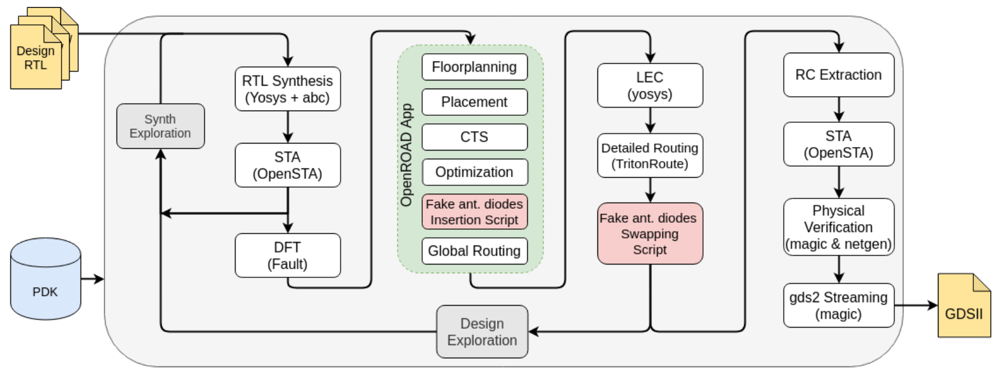
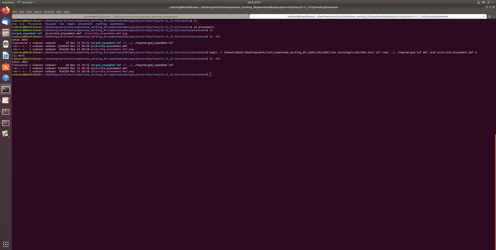
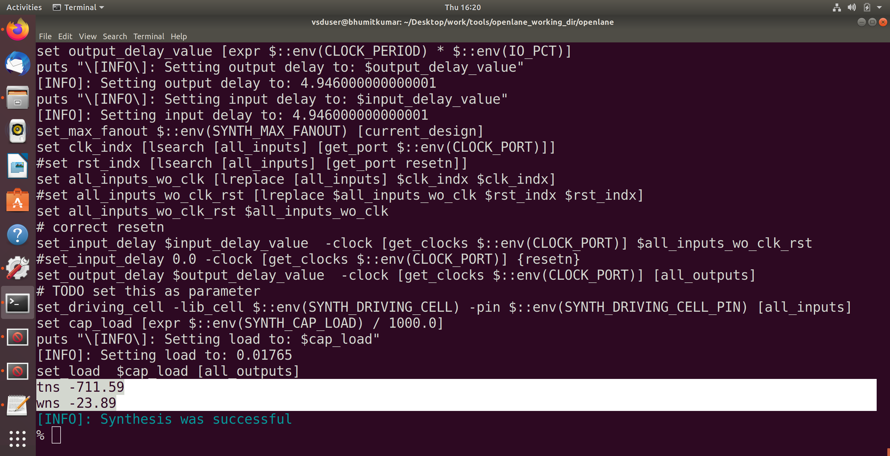
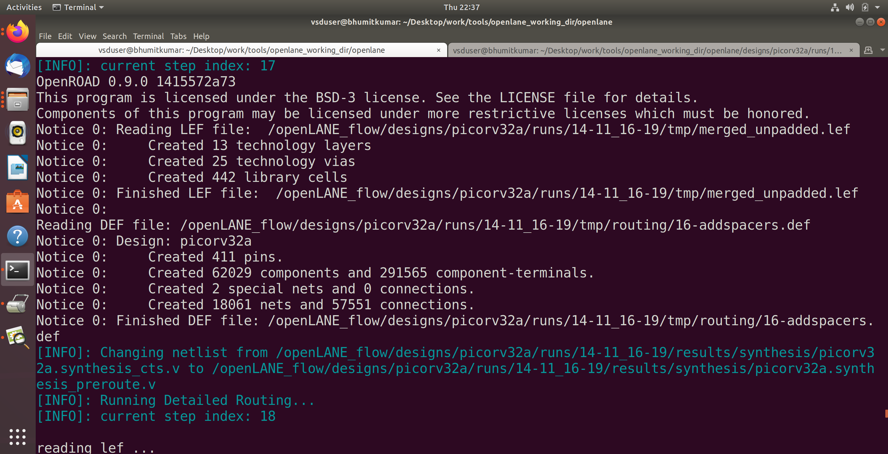

# ASIC Design Class
<details>
  
<summary>Lab 1: Compiling a small C program with gcc compiler and RISCV gcc compiler </summary>

## Lab 1A: Compiling a C program with gcc compiler, execute it and generate the output.

Write the C code in a file using any text editor and save it as sum1ton.c (source code).

Next, compile the source code using gcc compiler, this will generate the executable code.

Now, run the executable code to see the output.

Following image includes the source code and three commands to execute in terminal in sequence as shown, to generate the output.


## Lab 1B: Compiling a C program with RISCV gcc compiler, execute it, generate the output and compare with the output of Lab 1B.

The next task is to compile the sum1ton.c using RISCV gcc compiler using the command in following image, also to see the assembly code for C program, use the next command.


Observe that object code dump generates the following, main function is present at location 10184 and 15 instructions are present in assembly code.


Next, try 0fast of RISCV compiler for same C code and observe the object code dump, now the main function is located at 100b0 and number of instructions present is 12.


</details>

<details> 
  <summary>Lab 2: Simulating and degbugging c program with Spike RISC-V ISA Simulator </summary>

  ## Lab 2
</details>

<details>
  <summary>Lab 3: Write a C program for Gaussian elimination algorithm and run it on gcc and RISCV gcc </summary>

  ## Lab 3

  

  

</details>

<details>
  <summary>Lab 4: TL Verilog, Makerchip IDE, Build a 5 stage pipelined RISCV processor </summary>

  ## Lab 4

Implementing a combinational circuit in TLV : Four function calculator using multiplexer


RISCV Block diagram - To be implemented in TLV, blockwise


Program Counter


Instruction Fetch


Instruction Decode


ALU


Register Read


Register Write


Branching


RISCV implementation, combined cpu using above blocks.


Following shows the clock and reset signals in waveform.


The final sum getting accumulated with each cycle can be seen as following.


</details>

<details> 
  <summary>Lab 5: TL Verilog to Verilog conversion using Sandpiper and testing the converted Verilog based riscvcore </summary>

  ## Lab 5

In Lab 4, in makerchip, riscvcore is built using TL Verilog, it generates tlv file. The tlv file generated in Lab4 is given to Sandpiper converter to generate verilog code.
In Lab 5, task is to match the output waveforms generated on makerchip and those generated by gtkwave after running testbench.

Following image shows the verilog generated by Sandpiper being compiled by iverilog and output waveform can be seen in next image on gtkwave.
  


Clock name is clk_bhu(makechip) and clk_bhu1(gtkwave) and sum can be seen in out which matches the output of makerchip in lab 4 which was generated by TL Verilog riscvcore.
1. Makerchip waveforms - click on image to open in new tab for clear view of waveforms.

Clock signal - clk_bhu


Reset signal


Final sum


2. gtkwave waveforms - clk_bhu1, out sum
   
!

</details>

<details> 
  <summary>Lab 6: Simulating Riscv-core with PLL and DAC, Yosys installation. </summary>

  ## Lab 6

  In Lab 5, riscv core was compiled in iverilog and program to sum 1 to 9 was shown working with output seen in gtkwave.
  In lab 6, with riscv core, DAC and PLL are added and the output of sum of numbers can be seen with its analog equivalent.


Yosys installation for next lab.


</details>

<details>
<summary>Lab 7: RTL design using Verilog with SKY130 Technology </summary>
  
## Lab 7
1 - Introduction to Verilog RTL design and Synthesis


In above figure, the central block is design, which consists of verilog code written as per specification for desired functionality.

To test whether the desired fuctionality is achieved, we need testbench which contains verilog code to generate set of stimulus and for given stimulus corresponding code for observer. Testbench also contains timing information related to running of simulation.

To perform above tasks, we use iverilog compiler and gtkwave waveform viewer as shown in following figure


Following example shows a simple design of mux and corresponding testbench.
To run the verilog code in iverilog, and view waveforms in gtkwave, run the following three commands sequentially,


Mux module
```
module good_mux (input i0 , input i1 , input sel , output reg y);
always @ (*)
begin
	if(sel)
		y <= i1;
	else 
		y <= i0;
end
endmodule
```
Testbench for mux module
```
`timescale 1ns / 1ps
module tb_good_mux;
// Inputs
reg i0,i1,sel;
// Outputs
wire y;
// Instantiate the Unit Under Test (UUT), name based instantiation
	good_mux uut (.sel(sel),.i0(i0),.i1(i1),.y(y));
	//good_mux uut (sel,i0,i1,y);  //order based instantiation
initial begin
	$dumpfile("tb_good_mux.vcd");
	$dumpvars(0,tb_good_mux);
	// Initialize Inputs
	sel = 0;
	i0 = 0;
	i1 = 0;
	#300 $finish;
end
always #75 sel = ~sel;
always #10 i0 = ~i0;
always #55 i1 = ~i1;
endmodule
```
## Yosys and Logic synthesis

Yosys is a logic/RTL synthesis software suite which converts verilog, represented by Design block into netlist as shown in following diagram.

The block shown as .lib contains standard library cells which are present in pdk.

To perform synthesis, yosys needs commands as read_verilog, read_verilog, write_verilog.


Once netlist is generated, it needs to be verified, for that it is run through iverilog, output vcd file is generated, which is run through gtkwave.


Following command loads the liberty file containing standard cells, as shown, 418 cells types are imported,


Next, using read_verilog, we generated RTL for given design,


Following command is used for synthesis of top module


Following command generates the netlist,


Showing RTL design


Next write netlist which can be used for simulation,


The generated netlist is as follows


2 - (a) Timing libs, (b) hierarchical vs flat synthesis and (c) efficient flop coding styles

liberty file contains information about standard cells such as, timing, power, area parameters. Also, multiple forms of same logic cell are available in standard cell library with different characteristics.

Whenever there are multiple modules are present in design, the netlist can be synthesised in either hierarchical form or as flat form.


3 - Combinational and sequential optmizations

1. 2 input AND gate<br>
Run the following commands sequentially to generate netlist<br>
yosys<br>
read_liberty -lib ../lib/sky130_fd_sc_hd__tt_025C_1v80.lib<br>
read_verilog opt_check2.v<br>
synth -top opt_check2<br>
abc -liberty ../lib/sky130_fd_sc_hd__tt_025C_1v80.lib<br>
opt_clean -purge<br>
show


2. 2 input OR Gate<br>
Run the following commands sequentially to generate netlist<br>
yosys<br>
read_liberty -lib ../lib/sky130_fd_sc_hd__tt_025C_1v80.lib<br>
read_verilog opt_check.v<br>
synth -top opt_check2<br>
abc -liberty ../lib/sky130_fd_sc_hd__tt_025C_1v80.lib<br>
opt_clean -purge<br>
show


3. 3 input AND gate<br>
Run the command in similar manner as above with opt_check3.v


4. 2 input XNOR
Run the command in similar manner as above with opt_check4.v


In case of multiple modules, flatten command needs to be used before generating netlist, otherwise it will show following error.


5. D Flipflop with asynchronour reset - active low
yosys
read_liberty -lib ../lib/sky130_fd_sc_hd__tt_025C_1v80.lib
read_verilog dff_const1.v
synth -top dff_const1
dfflibmap -liberty ../lib/sky130_fd_sc_hd__tt_025C_1v80.lib
show


6. D Flipflop with asynchronour reset - active high<br>

yosys<br>
read_liberty -lib ../lib/sky130_fd_sc_hd__tt_025C_1v80.lib<br>
read_verilog dff_const2.v<br>
synth -top dff_const2<br>
dfflibmap -liberty ../lib/sky130_fd_sc_hd__tt_025C_1v80.lib<br>
show<br>


7. D Flipflop with asynchronour reset Design 3<br>

yosys<br>
read_liberty -lib ../lib/sky130_fd_sc_hd__tt_025C_1v80.lib<br>
read_verilog dff_const3.v<br>
synth -top dff_const3<br>
dfflibmap -liberty ../lib/sky130_fd_sc_hd__tt_025C_1v80.lib<br>
show<br>


8. D Flipflop<br>
yosys<br>
read_liberty -lib ../lib/sky130_fd_sc_hd__tt_025C_1v80.lib<br>
read_verilog dff_const4.v<br>
synth -top dff_const4<br>
dfflibmap -liberty ../lib/sky130_fd_sc_hd__tt_025C_1v80.lib<br>
show<br>


9. D Flipflop<br>
yosys<br>
read_liberty -lib ../lib/sky130_fd_sc_hd__tt_025C_1v80.lib<br>
read_verilog dff_const5.v<br>
synth -top dff_const5<br>
dfflibmap -liberty ../lib/sky130_fd_sc_hd__tt_025C_1v80.lib<br>
show<br>


10. Counter optimisation

yosys<br>
read_liberty -lib ../lib/sky130_fd_sc_hd__tt_025C_1v80.lib<br>
read_verilog counter_opt.v<br>
synth -top counter_opt<br>
dfflibmap -liberty ../lib/sky130_fd_sc_hd__tt_025C_1v80.lib<br>
show<br>


11. Counter optimisation 2

yosys<br>
read_liberty -lib ../lib/sky130_fd_sc_hd__tt_025C_1v80.lib<br>
read_verilog counter_opt2.v<br>
synth -top counter_opt2<br>
dfflibmap -liberty ../lib/sky130_fd_sc_hd__tt_025C_1v80.lib<br>
show<br>


4 - Gate level synthesis, blocking vs non-blocking statements and Synthesis-Simulation mismatch

Previously, RTL synthesis is carried out where netlist is generated from verilog code, which uses standard cells of pdk.
Observe that synthesised netlist and RTL verilog code are logically same. This netlist will contain for example and gate with input and output.
In gate level synthesis, abstract gates in synthesised netlist are replaced with gate level verilog models which can be functional models or timing aware models.

Once netlist generated after gate level synthesis, we need to do functional verification to remove synthesis-simulation mismatch. 
Some of the reasons for synthesis-simulation mismatch are, missing sensity list, block-non blocking assignments or non standard verilog code.


1. 2x1 mux using ternary operator<br>
Compilation in iverilog<br>


Output of synthesis<br>
yosys<br>
read_liberty -lib ../lib/sky130_fd_sc_hd__tt_025C_1v80.lib<br>
read_verilog ternary_operator_mux.v<br>
synth -top ternary_operator_mux<br>
abc -liberty ../lib/sky130_fd_sc_hd__tt_025C_1v80.lib<br>
opt_clean -purge<br>
write_verilog -noattr ternary_operator_mux_net.v<br>
show<br>


2. Bad 2x1 mux

Output of synthesis<br>
yosys<br>
read_liberty -lib ../lib/sky130_fd_sc_hd__tt_025C_1v80.lib<br>
read_verilog bad_mux.v<br>
synth -top bad_mux<br>
abc -liberty ../lib/sky130_fd_sc_hd__tt_025C_1v80.lib<br>
opt_clean -purge<br>
write_verilog -noattr bad_mux_net.v<br>
!gvim bad_mux_net.v<br>
show<br>


3. Related to blocking statement
yosys<br>
read_liberty -lib ../lib/sky130_fd_sc_hd__tt_025C_1v80.lib<br>
read_verilog blocking_caveat.v<br>
synth -top blocking_caveat<br>
abc -liberty ../lib/sky130_fd_sc_hd__tt_025C_1v80.lib<br>
opt_clean -purge<br>
write_verilog -noattr blocking_caveat_net.v<br>
show<br>


Synthesis-simulation mismatch example
1. missing sensitivity list
2. for blocking and non blocking statements
   
</details>

<details>
  
<summary>Lab 8: Synthesis of riscv core, pll and dac using SKY130 pdk </summary>

## Comparision of Functional simulation output and Synthesised output.

### Output waveforms of functional simulation


### Output waveforms of Synthesised verilog file


## Yosys stats related to synthesis


## Standard cells usage


</details>


<details>
  
<summary>Lab 9: Static Timing Analysis of design using OpenSTA </summary>

Static Timing analysis involves checking of design in terms of whether timing requirements are met for each path within the design.
The input to static timing analysis tool is the synthesised netlist generated, clock definations and other constraints related to input and output, it is independent of logic inputs.


source: https://www.vlsisystemdesign.com/static-timing-analysis-sta/

STA tool breaks down the whole design into different path and check whether the delay present in signal propogation is not creating issue in correct functioning of the design.

Two of the most common timing constraints in design are setup time and hold time constraints. When static timing analysis is performed, STA tool reports whether these timing constraints are met for everypath in design.

In this lab, OpenSTA is used to perform static timing analysis. 


### Lab Task 
1) Clock period of 10.15ns. 
2) Setup uncertainty and clock transition will be 5% of clock - use set_clock_uncertainty with 10.15 * 0.05
3) Hold uncertainty and data transition will be 8% of clock - use set_clock_uncertainty with 10.15 * 0.08

1) Input to OpenSTA includes synthesised netlist, liberty file containg pdk and other clock related and path related definations.
Following clock is created with period of 10.15ns


The report generated by OpenSTA is as follows,

for max delay in path


For min delay in path


</details>

<details>
  
<summary>Lab 10: Static Timing Analysis of design using OpenSTA for process corners</summary>

Below is the snapshot of SDC


Table of various slack report


</details>

<details>
<summary>Lab 11: Physical Design using OpenLANE and SkyWater130 PDK </summary>


# Physical Design using OpenLANE flow and SkyWater130 PDK

The main components of ASIC design includes following,

#### 1. RTL designs

Sources of RTL designs are librecores.org, opencores.org, github.com.

#### 2. EDA Tools

Open source EDA tools are Qflow, OpenROAD, OpenLane.

#### 3. Process Design Kit(PDK) data

An example of opensource PDK is Skywater 130nm PDK.


### Summary of simplified RTL to GDSII flow based on OpenLANE,

1. Synthesis - Design RTL is converted to circuits with componets form Standard cell library(SCL)

2. Floor/Power planning -

   a. Chip floor planning - partition the chip die between different system building blocks and place IO pads

   b. Macro Floor planning -  Dimensions, pin locations, rows definition

   c. Powerplanning - Power network is created which includes, Power pads, Power straps, Power rings

3. Placement - Place the cells on the floorplan rows

4. Clock Tree Synthesis - Create a clock distribution network to deliver the clock to all sequential elements

5. Routing - Connecting cells together using available metal layers

6. Sign Off - Includes Physical verification through Design Rules Checking(DRC) and Layout vs Schematic(LVS) and Timing verification through Static Timing Analysis(STA).




## Day 1 - Introduction to OpenLane

#### a. OpenLane working Directory


#### b. Design preparation steps


#### c. Review files generated after design preparation and Synthesised

#### d. Steps to characterise Synthesis results


Flop ratio calculations require, total number of cells synthesised and the number of flipflops among that,

```math
Flop\ ratio = \frac{number\ of\ flipflops}{total\ number\ of\ cells} = \frac{1613}{14876} = 0.10842968539

```
```math
Percentage\ of\ D-flipflops = 0.10842968539 * 100 = 10.842968539\ \%
```
## Day 2 - Floorplan and Introduction to library cells

#### a. Chip Floor planning considerations

1. Utilization factor and aspect ratio
2. Pre-placed cells
3. De-coupling capacitors
4. Power planning
5. Pin Placement and logical cell placement blockage
6. Floorplan in OpenLane and review layout in Magic
   


<ins>Calculations of die area based on results generated from floorplan run</ins>

Floorplan run


tcl console for interaction


Tapcells


IO pads


Standard Cells


#### b. Library Binding and Placement

Need for libraries and characterisation

1. Netlist binding and initial place design
2. Optimise placement using estimated wire-length and capacitance
3. Final Placement optimisation
4. Congestion aware placement using Replace

Placement run


Output of placement run


Director after placement run



Placement of standard cell


#### c. Cell design and characterization follows

1. Inputs for cell design follows
2. Circuit design Steps
3. Layout design steps
4. Typical characterization flow

#### d. General timing and characterization parameters

1. Timing threshold deifinitions
2. Propogation delay and transition time

## Day 3 - Design library cell using Magic layout and ngspice characterisation

#### a. CMOS inverter - Layout in Magic and spice simulation in ngspice


<ins>Editing spice inverter design</ins>

Extracting spice netlist from layout


Generated spice netlist


Editing spice netlist


Running ngspice 


Transient simulation of inverter


#### b. Merging CMOS inverter cell in picorv32a design


open inverter cell in magic


Creating new cell


Directory structure with new cell


set environment variables for merging inverter cell with picoriscv32a


Synthesis after merge




sky130_bhu in merged lef


Initiate the floorplan


placing IOs


Tapdecap


Completion of placement after merging of inverter


Run Magic


Output of magic after inserting inverter


sky130_bhu cell in layout


sky130_bhu cell in cellmanager


## Day 4 - Pre-layout timing analysis and Clock tree synthesis

Timing reports generated before clock tree synthesis
Followin report shows the slack report generated


/home/vsduser/Documents/current141/12timing.png
/home/vsduser/Documents/current141/13timing.png
/home/vsduser/Documents/current141/14timing.png
/home/vsduser/Documents/current141/15timing.png
/home/vsduser/Documents/current141/16timing.png


#### Clock tree synthesis using TrintonCTS and signal integrity

Performing Clock tree synthesis


Output of cts run


Generated cts def


CTS in layout


## Day 5 - Final steps for RTL2GDS using trintonRoute and OpenSTA

Giving commands for generating power distribution network - gen_pdn


PDN run


PDN run complete


Using magic to see layout with PDN


Top view of layout with PDN


Power rails


Directory structure after PDN run


#### Routing using TrintonRoute

Command to begin routing - run_route


Routing takes multiple iterations to get zero violations



Routing ends with zero violations


Directory structure after routing and Opening magic to view layout after routing


Generated layout after routing


Routing seen between layers


SPEF Extraction is performed using python script


Post Route Timing analysis

Performing post route timing analysis using OpenSTA


Reading related files to do timing analysis


Post Route timing reports


</details>

